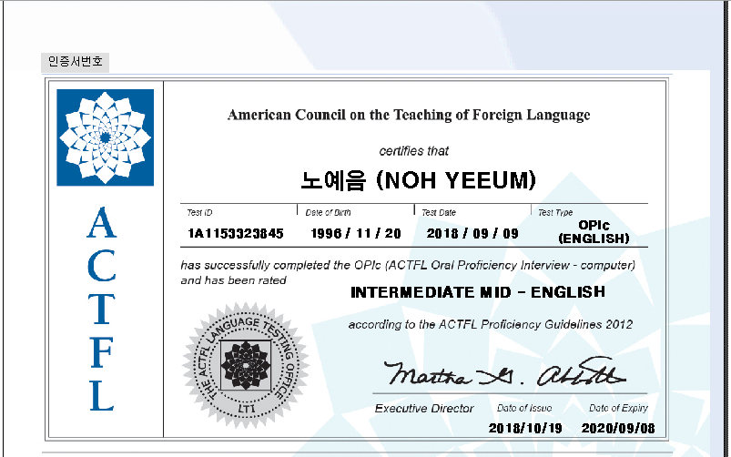

# ENGLISH（英語）
## OPIc Intermediate Mid

## Photoshop Seminar
<iframe width="560" height="315" src="https://www.youtube.com/embed/Dfxz4gGmM2g?si=ICNGki4IdmQpcefQ" title="YouTube video player" frameborder="0" allow="accelerometer; autoplay; clipboard-write; encrypted-media; gyroscope; picture-in-picture; web-share" referrerpolicy="strict-origin-when-cross-origin" allowfullscreen></iframe>

### 何を担当した？
+ PC環境構築
+ PPT資料作成・発表
+ 温度、湿度センサー制御
### 印象に残ったエピソードは？
+ 受講した先生たちがゲール体験のキャンプ場に連れてくれて、その日見た夜空が忘れられない
   

# PROGRAMMING（開発言語）
## Python Coding Specialist 2級
